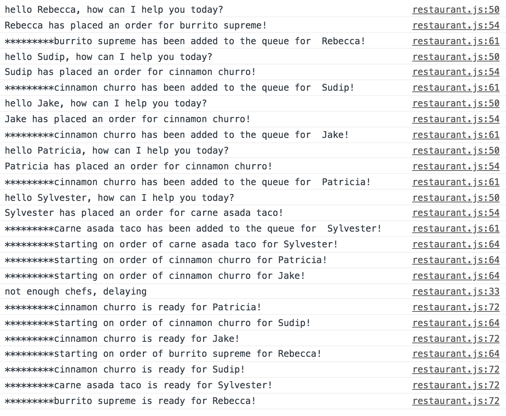

# Restaurant sim

### tasks
- update restaurant.js (further instructions in each file)
	- add code to open function
	- add code to close function
	- add code to checkQueue function
	- complete startCookingOrder function
	- complete finishCookingOrder function

#### final output example: 

